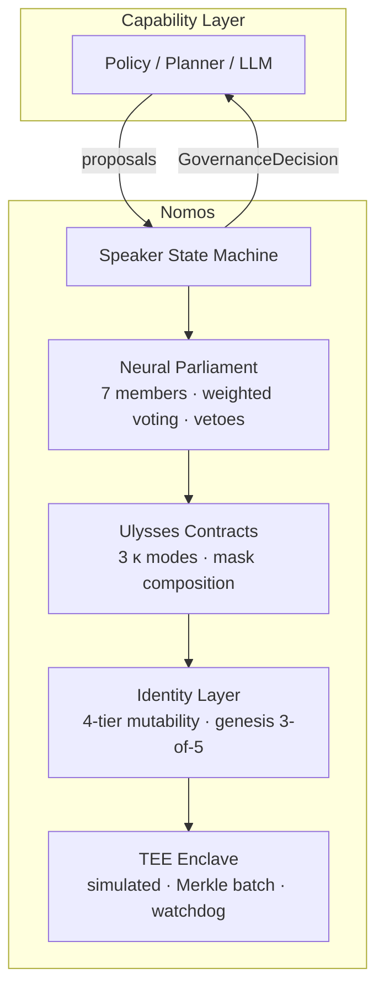

# Nomos

**A formal framework and reference implementation for self-governing AI.**

The Neural Parliament, Ulysses Contracts, and Identity Layer —
a complete architecture for constraining autonomous agents through deliberation,
pre-commitment, and identity coherence.

[](https://github.com/Nomos-N4s/nomos/actions/workflows/tests.yml)
[](https://nomos-n4s.github.io/nomos/)
[](LICENSE)
[](https://github.com/Nomos-N4s/nomos/releases/latest)
[](pyproject.toml)
[](CHANGELOG.md)
[](gov-budget-proof/)
[](https://docs.astral.sh/ty/)
[](https://coderabbit.ai)

---

## Why

Modern AI systems optimise actions against objectives. As autonomy increases, the
critical failure mode shifts from *alignment* (did I learn the right objective?)
to *governance* (should I be pursuing this objective at all?).

This framework proposes that intelligence requires **two capabilities**: optimising
decisions and *governing the space of possible decisions*. Nomos (formerly the
Governance Layer) implements the latter through three interoperable layers.

---

## Architecture



| Component | Role |
|---|---|
| **Neural Parliament** | 7 specialised members (Reward, Safety, Curiosity, Planning, Memory, Social, Integrity) score proposals, check tag compliance, veto dangerous actions, and vote via weighted range voting. |
| **Ulysses Contracts** | Binding pre-commitments that restrict the agent's future action space. Enacted by supermajority, revoked only by unanimity. Three enforcement modes: procedural inertia (κ₁), budget caps (κ₂), timelocks (κ₃). |
| **Identity Layer** | Formal ontology + core commitments + 4-tier mutability (Constitutional → Dynamic → Operational → Immutable) + genesis 3-of-5 multisig bootstrapping + bounded parameter envelope. |
| **TEE Enclave** | Simulated trusted execution environment: sealed storage, attestation, Merkle-tree batch verification, hardware watchdog with deadlock breaker, constant-time data-oblivious operations. |

Deployment topology is a recorded decision: the system ships as a **modular
monolith** (core + dashboard, one atomic governance gate) with explicit,
evidence-based split signals. See
[ADR 0001](docs/adr/0001-modular-monolith-and-atomic-governance-gate.md).

---

## By the Numbers

```
Formal predictions verified:    12 / 12
Lean 4 theorems proven:          budget_invariant_holds, vote_resolution_decidable,
                                 budget_preserves_positive, falsification_params_are_immutable
Reference implementation:        ~2,800 lines · 50+ files · 10 subpackages
Benchmark coverage:              4 scenarios × 5 strategies × 20 seeds × 1,000 steps
Review rounds survived:          8 (5 theory + 3 implementation) · 3 residual risks acknowledged
```

## Quick Start

```bash
pip install -e .
python -m src.nomos.runner speaker
python -m src.nomos.runner prove --all
python -m src.nomos.runner all --baselines --steps 1000 --seeds 5
```

## Testing

```bash
python -m pytest tests/ -v
make coverage   # coverage run -m pytest tests/ -q && coverage report --fail-under=60 -m
```

CI runs the same suite with line + branch coverage, posts coverage comments
on PRs, and enforces the 90% line threshold from 2026-09-11 (baseline at
adoption: 93%).

## Containerized

Versioned multi-arch images (`linux/amd64` and `linux/arm64`) are published to
GHCR on every `v*` tag:

```bash
docker pull ghcr.io/nomos-n4s/nomos:v0.8.0          # core, default entrypoint
docker pull ghcr.io/nomos-n4s/nomos:with-rl         # includes PyTorch RL stack
docker pull ghcr.io/nomos-n4s/nomos:latest          # latest stable core (skipped for pre-releases)
```

Run the reference implementation inside the image:

```bash
docker run --rm ghcr.io/nomos-n4s/nomos:v0.8.0 all --steps 10 --seeds 1
```

Local development builds use the same image name with `dev` tags
(`make docker-build`, `make docker-build-rl`, `make reproduce`); published
images are immutable per version tag.

## Dashboard

```bash
streamlit run src/nomos/dashboard/app.py
```

Four tabs: Formal Model reference, step-by-step Parliament replay, benchmark
comparisons with Cohen's d effect sizes, and RL training results (governed vs ungoverned).

The RL Training tab has an optional **Auto-refresh** toggle for watching a long
Colab training run land in near-real-time: when enabled, the dashboard polls
`results/rl/` every 30s, shows a "Last updated" timestamp, and surfaces a
"🟢 Live from Colab" indicator the moment new CSVs appear. It's off by default
and safe to leave on — refreshing never triggers a full page reload.

---

## Formal Predictions

Every formal claim in the book chapters has a corresponding executable test:

| # | Chapter | Prediction | Status |
|---|---|---|---|
| 1 | Ch2 §3.1 | Budget caps proposals per member (κ₂) | ✓ |
| 2 | Ch2 §3.2 | CRITICAL_SAFETY priority before ROUTINE | ✓ |
| 3 | Ch2 §3.4 | Weighted vote outcome matches formal spec | ✓ |
| 4 | Ch2 §3.7 | Tag falsification halves budget after 3+ offences | ✓ |
| 5 | Ch3 §2.1 | Contract restricts action set (allowed ∩ restricted) | ✓ |
| 6 | Ch3 §2.3 | Revocation threshold > enactment threshold | ✓ |
| 7 | Ch3 §2.4 | Timelock decrements monotonically | ✓ |
| 8 | Ch3 §3.0 | Mask composition: (allowed − restricted) | ✓ |
| 9 | Ch4 §2.1 | Low-coherence proposal triggers integrity veto | ✓ |
| 10 | Ch4 §2.5 | Tier-4 requires external multisig; lower tiers do not | ✓ |
| 11 | Ch4 §3.1 | Genesis 3-of-5: 2 sigs insufficient, 3 sigs authorises | ✓ |
| 12 | Ch4 §3.6 | Deadlock breaker fires after N defaults, resets | ✓ |

Run them yourself: `python -m src.nomos.runner prove --all`

---

## Adversarial Evidence

The predictions above are verified by *scripted* tests. Predictions 1, 2 and 4 are
additionally tested against a **learned adversary**: a PPO policy rewarded for
defeating governance, free to forge priority tags, under-report risk, and flood
the agenda. Hypotheses, metrics, and thresholds were
[pre-registered](book/appendix-e-preregistration.md) before the run.

100,000 timesteps × 5 seeds × 3 modes:

| # | Hypothesis | Metric | Result |
|---|---|---|---|
| H1 | Budgets bound proposals (κ₂) | over-budget cycles | **PASS** — 0, cap held at 3 under 6-proposal floods |
| H2 | `CRITICAL_SAFETY` ordering holds | spoofed poison executed | **PASS** — 0.000 (threshold ≤ 0.01) |
| H3 | Falsification is deterred | detection rate | **PASS** — 1.000 across 7,546 spoof attempts |

**Zero of 4,762 adversarial poison attempts executed**, on every seed. But the
adversary did win something: it **silenced the Safety committee on 100% of its
proposals**, learning to assert low risk on tiles it knew were poison. Safety
scores proposer-supplied metadata and is trivially fooled. What stopped the
attack was the Integrity committee, which verifies against ground truth.

> The result is **not** "governance is unbreakable" — it is that **defense in
> depth is load-bearing**. One of the two veto committees fell completely; the
> layer held because a second, independently-grounded check sat behind it. A
> governance layer whose committees all trust proposer-asserted metadata would
> have been defeated outright.

Full numbers, per-seed values, and limitations: [Appendix E](book/appendix-e-rl-adversary.md).
Reproduce: `uv sync --extra rl-repro && python -m src.nomos.experiments.rl_adversary protocol --timesteps 100000 --seeds 42 43 44 45 46`

---

## Project Structure

```
src/nomos/
├── speaker.py          # State machine orchestrating the full governance cycle
├── models.py           # PriorityTag, Action, Proposal, GovernanceDecision
├── runner.py           # CLI: benchmarks, prove, speaker, RL adversary
├── committee/          # 7 Parliament members (ABC + concrete implementations)
├── contracts/          # Ulysses Contract lifecycle, 3 κ modes, mask merger
├── identity/           # Ontology, commitments, 4-tier mutability, keys, params
├── ontology/           # Storage: MemoryBackend + optional Neo4j
├── tee/                # Simulated enclave, Merkle batching, watchdog
├── experiments/        # GridWorld, TemptationBank, DriftLab, DeadlockMaze
├── benchmarks/         # 4 baselines, Cohen's d, bootstrap CIs, figures
├── prove/              # 12 formal prediction test runners
└── dashboard/          # Streamlit app (4 tabs)
```

---

## Properties

- **Fully algorithmic** — no neural networks, no gradients, no learned parameters
- **Deterministic** — same inputs always produce same outputs
- **Gradient barrier** — discrete protocol operations break backpropagation
- **SDoS-resistant** — proposal budgets and priority tags prevent flooding

---

## Related Work

Nomos is **invariant-checked**, not proven safe in general. Where that places it
against its nearest neighbors — shielding, constrained MDPs, reward machines,
guaranteed-safe AI, and the agent-governance frameworks (AgentSpec, MI9,
AgentBound) — is set out in
[Chapter 5: Related Work](book/chapter-05/05-related-work.md), on four axes:
what is enforced, when, by what guarantee, and against whom.

Short version: shielding and guaranteed-safe AI offer a **stronger** guarantee
than Nomos does; the agent-governance frameworks sit on the same rung with more
deployment evidence; the one axis where Nomos currently has something they do not
is an adversary trained specifically to defeat the mechanism
([Appendix E](book/appendix-e-rl-adversary.md), [Appendix F](book/appendix-f-verifier-frontier.md)).

---

## Contributing

See [CONTRIBUTING.md](CONTRIBUTING.md). By submitting a PR you accept the
[Contributor License Agreement](CLA.md).

## Citation

```bibtex
@software{nomos,
  author    = {Carlos Pinto (xcoder-es)},
  title     = {Nomos: A Formal Framework for Self-Governing AI},
  year      = {2026},
  url       = {https://github.com/Nomos-N4s/nomos},
}
```

## License

[Apache 2.0](LICENSE) — permissive open-source license, commercial use permitted.
