# Architecture Diagrams

Visual overview of the Governance Layer framework. All diagrams render natively on GitHub (Mermaid).

---

## 1. Three-Layer Architecture

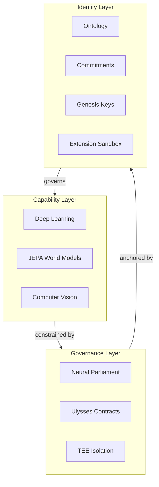

---

## 2. Neural Parliament — Full Decision Flow

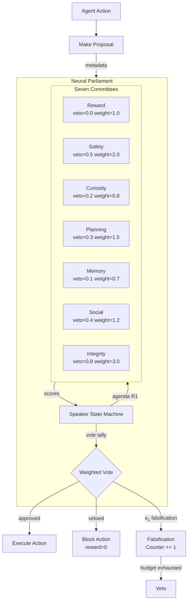

---

## 3. Agenda Sorting and Budget Enforcement

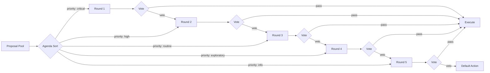

---

## 4. Ulysses Contracts Lifecycle

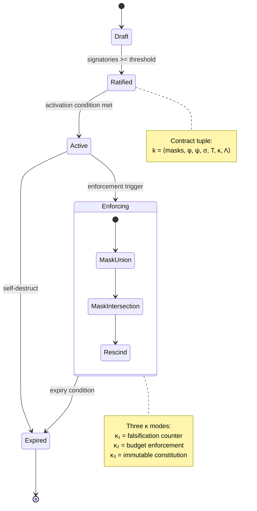

---

## 5. Contract Enforcement Modes (κ)

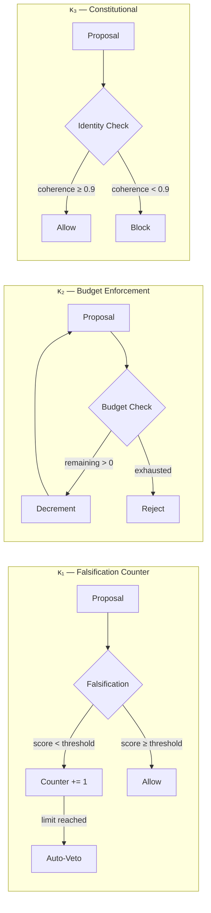

---

## 6. Identity Layer Structure

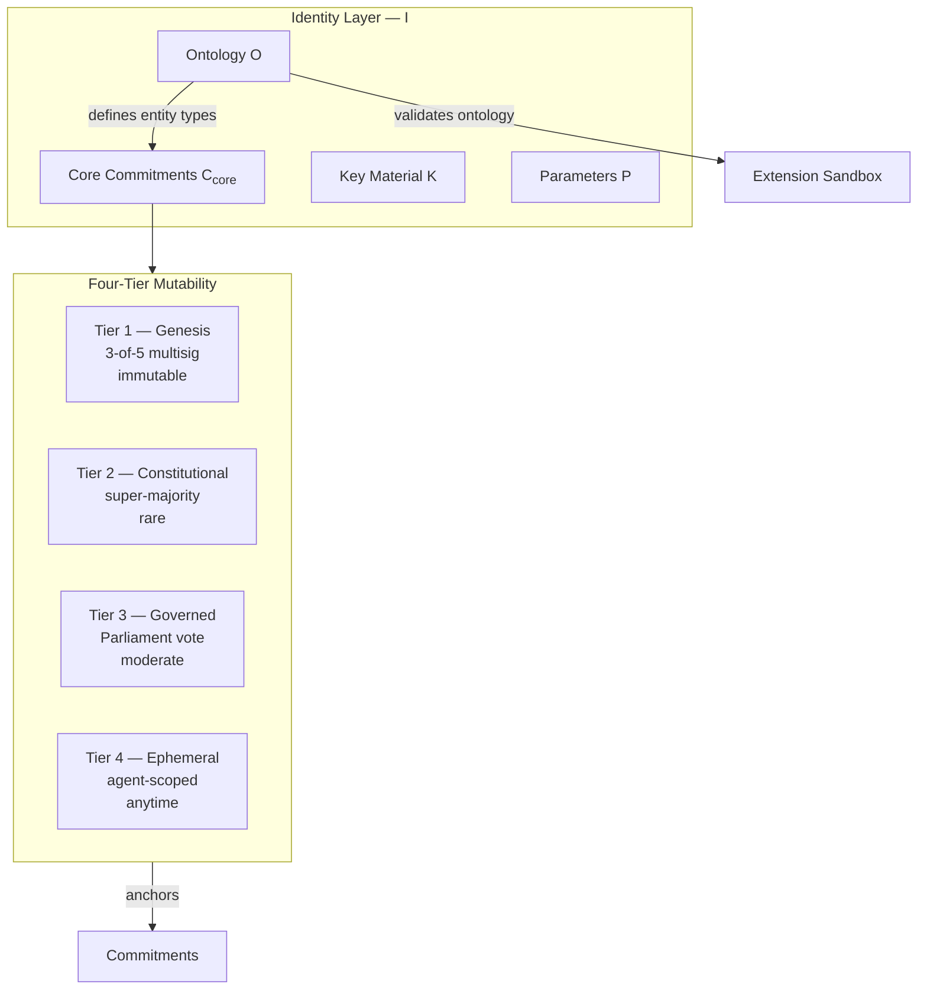

---

## 7. Genesis Bootstrapping

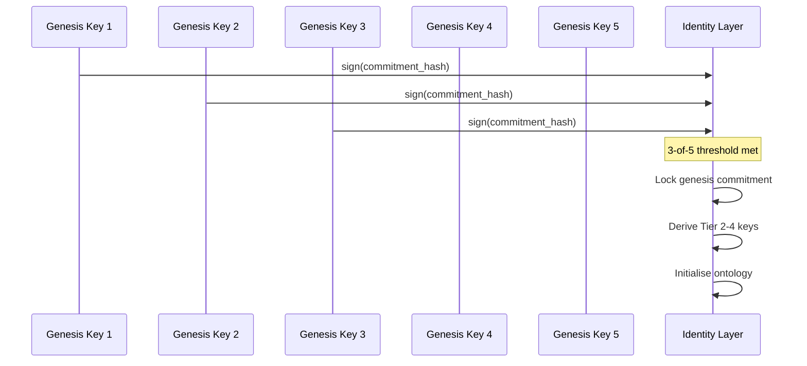

---

## 8. RL Training Pipeline with Governance

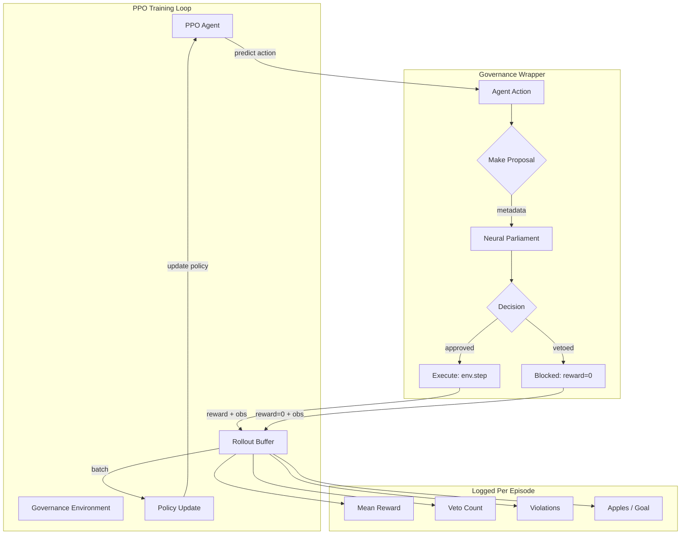

---

## 9. Experiment Scenarios

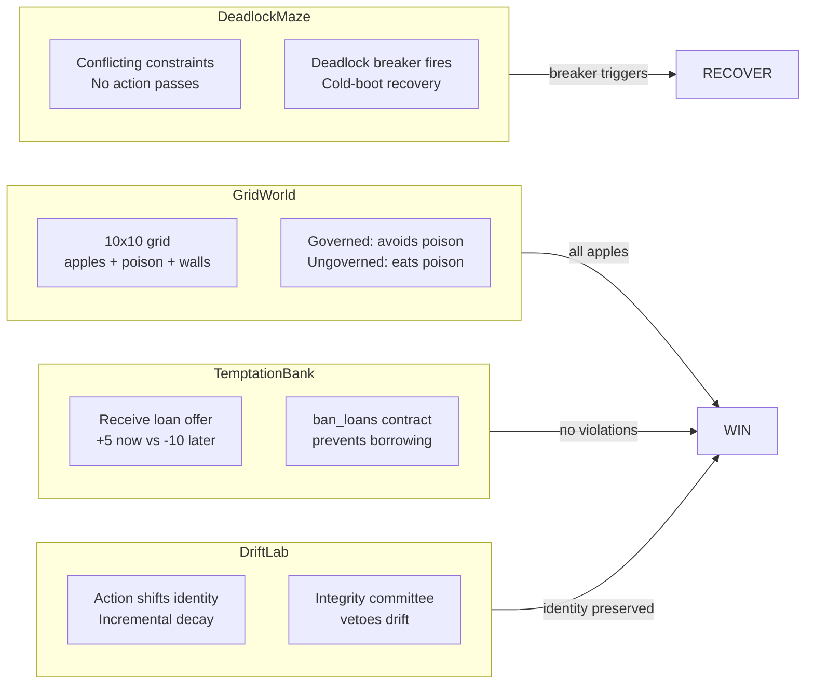

---

## 10. Benchmark Results (4 Scenarios x 5 Strategies)

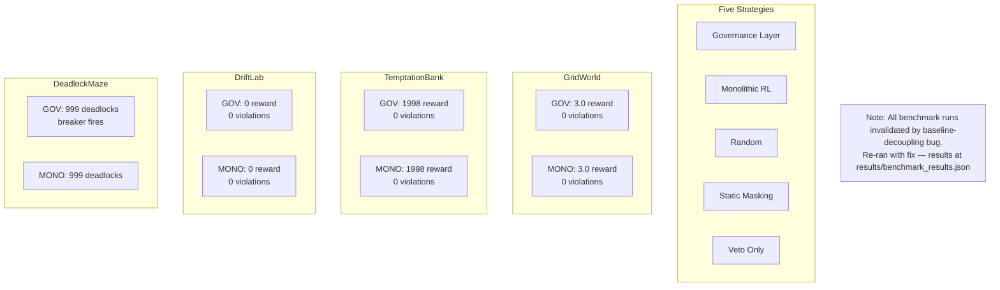

---

## 11. PPO Training Results (Governed vs Ungoverned)

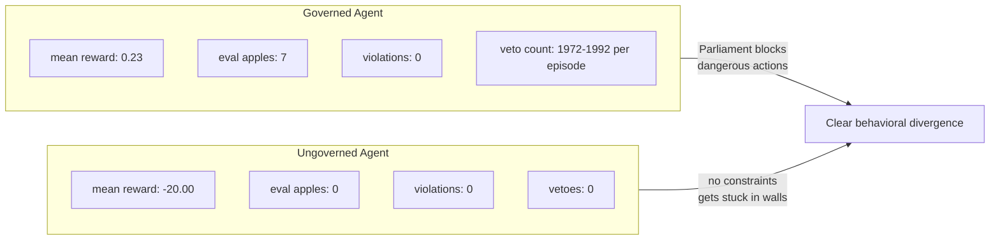

---

## 12. Minigrid Benchmark Results (Empty-8x8)

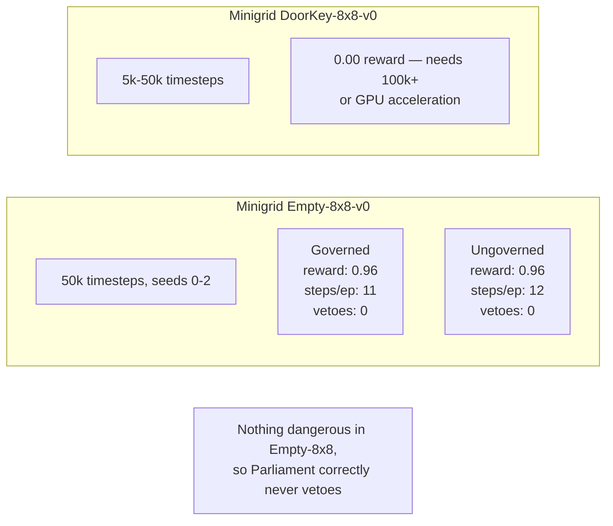

---

## 13. TEE Isolation Architecture

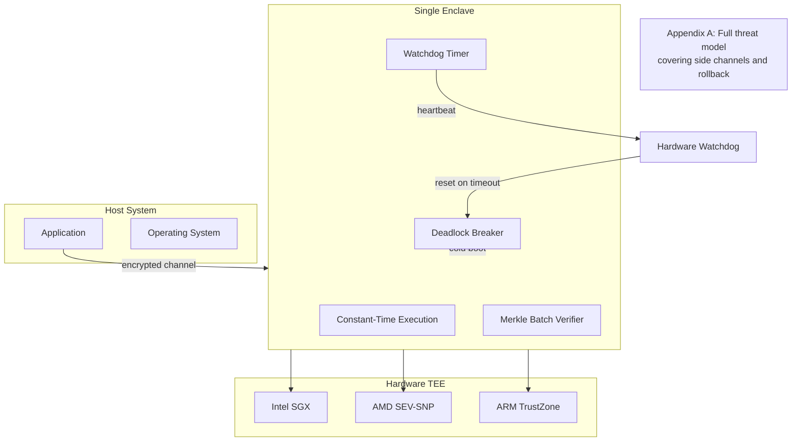

---

## 14. File and Module Structure

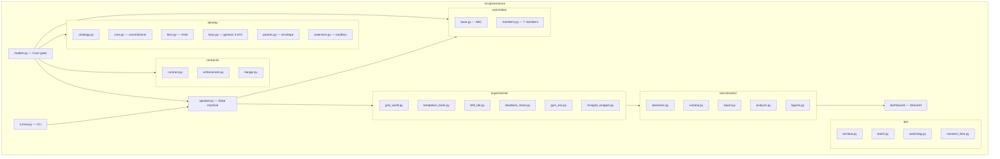

---

## 15. Identity Extension Sandbox

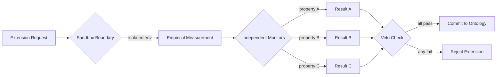

---

*All diagrams use standard Mermaid syntax compatible with GitHub-Flavored Markdown. No HTML tags, no custom classDef, no nested \\text{}.*
