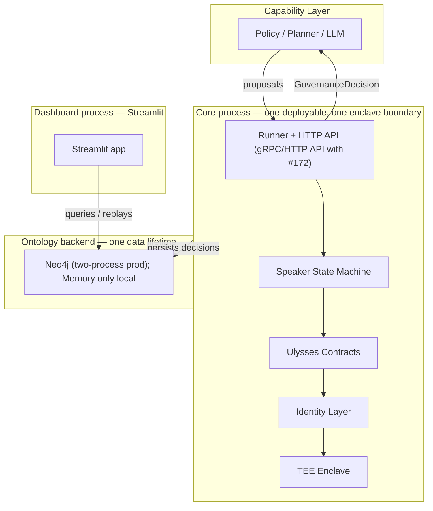

# ADR 0001: Modular Monolith and the Atomic Governance Gate

- **Status:** Accepted (decision taken 2026-08-11, execution-plan decision #3; this record makes it binding and reviewable)
- **Date:** 2026-08-12
- **Issue:** [#220](https://github.com/Nomos-N4s/nomos/issues/220) (Track J-F1, epic #214 — One-cloud deployment: Azure-first)
- **Superseded by:** N4 / Track L — [#229](https://github.com/Nomos-N4s/nomos/issues/229) (atomicity and service-split criteria) extends this record; [#226](https://github.com/Nomos-N4s/nomos/issues/226) supplies the measured evidence that can trigger a split.

## Context

Every milestone reopens the same question: *"should we split into microservices now?"*

The honest answer is **no**. The system is one bounded context — the governance gate:
Speaker → contracts → identity — and its core promise is that the gate is
**atomic**: a proposal is scored, vetoed, and voted on as a single unit of
decision (Chapter 2, "The Neural Parliament"). Splitting that pipeline across
processes converts a local, transactional decision into a distributed protocol
with partial-failure and ordering hazards — without a single measurement
showing a need for it.

Three forces pin the topology down:

1. **Gate atomicity (Chapter 2).** The propose → score → veto → vote cycle is
   enforced inside the Speaker state machine (`src/nomos/speaker.py`).
   Cross-process round-trips would break the invariant that a decision is
   emitted only after the full committee cycle completes.
2. **TEE enclave semantics (Appendix A §9).** The threat model is built around a
   *single enclave* holding the governance state machine (Appendix A §9.4 —
   single-enclave architecture; §A.9.5 deadlock-breaker cold boot). One
   process, one enclave boundary, one attestation story. Multiple services
   would multiply enclave-to-enclave channels that the model does not define.
3. **Operational simplicity.** A solo maintainer deploys, debugs, and rotates
   one artifact pair. Ten services means ten ways to fail, ten dashboards, and
   a credential surface that no current workload justifies.

## Decision

**Deploy Nomos as a modular monolith.**

- **Max two processes** in production topology today:
  - **Core** — runner + HTTP API (gRPC/HTTP API lands with the
    language-agnostic protocol, [#172](https://github.com/Nomos-N4s/nomos/issues/172), Track F-F4).
  - **Dashboard** — Streamlit app (`src/nomos/dashboard/`).
- **One deployable artifact pair** — the core container and the dashboard
  container, published from the same release (GHCR images, Track I).
- **One data lifetime** — a single ontology backend shared by core and
  dashboard; no per-service databases. The in-process ``MemoryBackend`` is
  valid **only in single-process/local mode** (core and dashboard in one
  process — e.g., local development with the embedded dashboard). In the
  two-process production topology each process would construct its own
  in-memory store, so the shared backend **must** be the Neo4j-backed store
  (``NEO4J_URI``; the IaC in #221 provisions it) or an API-mediated shared
  persistence path once the core API lands (#172). A dashboard that cannot
  reach the shared backend must **fail closed** in production, not silently
  fall back to memory.
- **One atomic gate** — all governance state transitions happen inside the
  core process; the dashboard only *queries* and *replays* decisions.
  Dashboard writes (e.g., the replay log in
  ``src/nomos/dashboard/parliament_tab.py``) are **non-authoritative
  projections** — observational copies of decisions for display, never
  authoritative governance transitions. Authoritative state is written only
  by the core process (or by the audit log's ``append``, which only the core
  and identity-authorized components touch).

## Topology

## Consequences

**Good:**

- The atomic-gate property holds by construction — no distributed protocol to
  reason about.
- One deployable artifact pair: the ACA (Azure Container Apps) topology from
  [#221](https://github.com/Nomos-N4s/nomos/issues/221) has exactly two
  containers to configure, probe (`/healthz`, `/readyz`), and scale.
- The TEE threat model (Appendix A §9) maps one-to-one onto the deployment.

**Acceptable trade-offs:**

- Core and dashboard scale together, not independently. Today they must:
  the dashboard replays the core's decisions, and any divergence of the two
  would break observability coherence.
- A future third-party consumer must go through the core's API (#172), not
  through a dedicated service — acceptable until real consumer pressure
  exists.

## Split signals — when microservices become correct

The monolith is not a dogma; it is the answer to *today's* evidence. Splitting
is triggered by *measured* facts, each tied to a concrete issue:

| Signal | Threshold / evidence | Issue that must produce it |
|---|---|---|
| Cross-process latency budget exceeded | Measured core round-trip latency above the performance budget (e.g. p95 vs. budget) with the monolith deployed and load-tested | [#226](https://github.com/Nomos-N4s/nomos/issues/226) — performance budget & profiling harness (Track L-F1) |
| Independent scaling evidence | A metric shows core and dashboard demand diverge so far that co-scaling wastes more than N× capacity, evidenced by the verification run and SLOs | [#222](https://github.com/Nomos-N4s/nomos/issues/222) verification run, [#165](https://github.com/Nomos-N4s/nomos/issues/165) SLOs + alerting |
| Decoupled third-party consumers | Real consumers of the governance protocol beyond the core's own API — they face the language-agnostic protocol | [#172](https://github.com/Nomos-N4s/nomos/issues/172) — language-agnostic governance protocol (Track F-F4) |
| Formal service-split criteria | The atomicity-preserving conditions for a split are formalized; no split before this exists | [#229](https://github.com/Nomos-N4s/nomos/issues/229) — atomicity & service-split criteria ADR (Track L-F4) |

Until at least one signal is backed by the listed evidence, topology changes
must be rejected in review with a pointer to this record.

## Alternatives considered

- **Event-driven microservices now.** Breaks gate atomicity (distributed
  propose → score → veto → vote), multiplies the operational burden roughly
  tenfold for zero measured benefit, and forces the TEE model to span multiple
  enclave boundaries (Appendix A §9 defines one). Rejected 2026-08-11
  (execution-plan decision #3), before any deployment exists to measure
  against.
- **Staying silent (no ADR).** The architecture decision remains oral history
  and is re-litigated in every review. This record exists to fix exactly that.

## References

- Chapter 2 — the Neural Parliament and the propose → score → veto → vote
  cycle: `book/chapter-02/02-neural-parliament.md`
- Appendix A §9 — single-enclave architecture, watchdog, deadlock breaker:
  `book/appendix-a/tee-isolation.md`
- Track E deploy-first reorder and Azure-first decision: `ROADMAP.md`
- This ADR is superseded/extended by Track L: `#229` (criteria) and `#226`
  (evidence gate).
