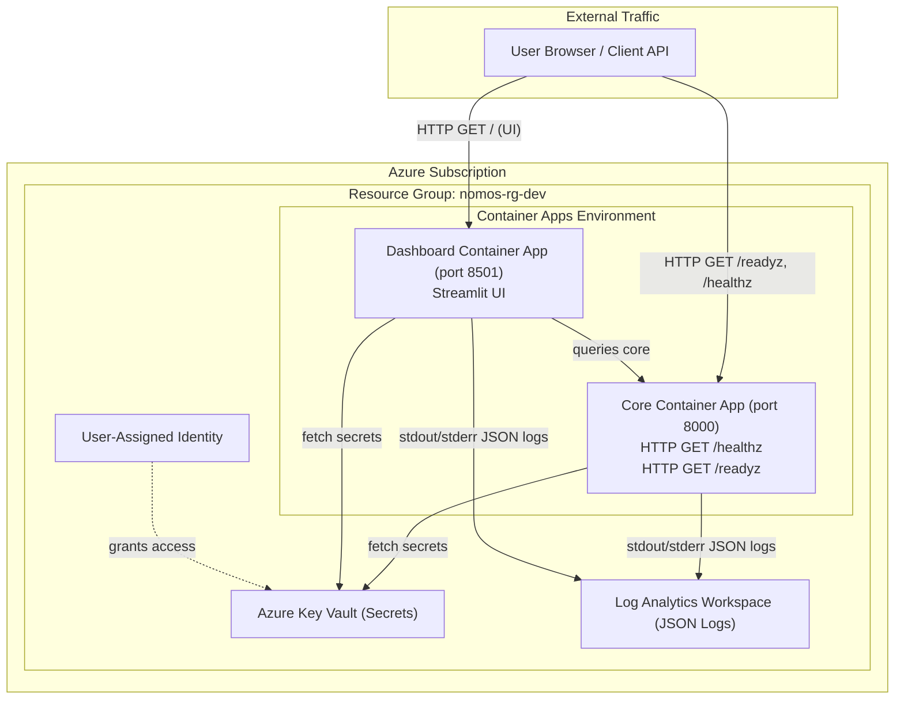

# Azure Container Apps Deployment (Pulumi IaC)

This document provides the operational guide for deploying Nomos to **Azure Container Apps (ACA)** using the Pulumi Infrastructure as Code (IaC) program located in `infra/azure/`.

The deployment topology strictly adheres to [ADR 0001: Modular Monolith](../adr/0001-modular-monolith-and-atomic-governance-gate.md) and issue [#221](https://github.com/Nomos-N4s/nomos/issues/221).

---

## Architecture Topology



---

## Component Breakdown

1. **Core Container App:**
   - **Image:** `ghcr.io/nomos-n4s/nomos:0.13.0` <!-- x-release-please-version -->
   - **Entrypoint:** `python -m nomos.runner serve --host 0.0.0.0 --port 8000`
   - **Probes:**
     - Liveness: `HTTP GET /healthz` (Port 8000)
     - Readiness: `HTTP GET /readyz` (Port 8000)
2. **Dashboard Container App:**
   - **Image:** `ghcr.io/nomos-n4s/nomos:0.13.0` <!-- x-release-please-version -->
   - **Entrypoint:** `streamlit run src/nomos/dashboard/app.py --server.port=8501 --server.address=0.0.0.0`
   - **Liveness Probe:** `HTTP GET /_stcore/health` (Port 8501)
3. **Key Vault & Managed Identity:**
   - Secrets (`NEO4J_URI`, `NEO4J_USER`, `NEO4J_PASSWORD`, `OPENROUTER_API_KEY`) are stored in Azure Key Vault.
   - Container Apps access Key Vault secrets securely using a User-Assigned Managed Identity.
4. **Log Analytics Workspace:**
   - Aggregates structured JSON logs emitted by container stdout/stderr.

---

## Quickstart Guide

### Prerequisites

- [Azure CLI (`az`)](https://learn.microsoft.com/en-us/cli/azure/install-azure-cli) logged in via `az login`
- [Pulumi CLI](https://www.pulumi.com/docs/install/) logged in via `pulumi login`
- Python 3.10+ & `uv` package manager

### Step-by-Step Deployment

```bash
# 1. Authenticate with Azure
az login

# 2. Navigate to Pulumi directory
cd infra/azure

# 3. Create virtual environment & install dependencies
python -m venv venv
source venv/bin/activate  # On Windows: venv\Scripts\activate
pip install -r requirements.txt

# 4. Select stack
pulumi stack init dev

# 5. Set configuration options
pulumi config set azure-native:location eastus
pulumi config set --secret neo4j_uri "neo4j+s://<instance>.databases.neo4j.io"
pulumi config set --secret neo4j_user "neo4j"
pulumi config set --secret neo4j_password "<your-password>"
pulumi config set --secret openrouter_api_key "sk-or-v1-<your-key>"

# 6. Preview infrastructure changes
pulumi preview

# 7. Provision stack
pulumi up
```

---

## Configuration Reference

| Pulumi Config Key | Type | Default | Description |
|---|---|---|---|
| `azure-native:location` | string | `eastus` | Azure target region |
| `nomos-azure:environment_name` | string | `dev` | Deployment environment tag |
| `nomos-azure:image_repository` | string | `ghcr.io/nomos-n4s/nomos` | GHCR container repository |
| `nomos-azure:image_tag` | string | current release | Image tag to deploy; defaults to the `.release-please-manifest.json` version. Override to pin an older image. |
| `nomos-azure:core_cpu` | float | `0.5` | vCPU allocation for Core container |
| `nomos-azure:core_memory` | string | `1.0Gi` | RAM allocation for Core container |
| `nomos-azure:dashboard_cpu` | float | `0.5` | vCPU allocation for Dashboard container |
| `nomos-azure:dashboard_memory` | string | `1.0Gi` | RAM allocation for Dashboard container |
| `nomos-azure:neo4j_uri` | secret | (placeholder) | Neo4j Aura connection URI |
| `nomos-azure:neo4j_user` | secret | `neo4j` | Neo4j username |
| `nomos-azure:neo4j_password` | secret | (placeholder) | Neo4j password |
| `nomos-azure:openrouter_api_key` | secret | (placeholder) | OpenRouter API Key for Agent validation |

---

## Deployment Verification Checklist (#222)

After deploying via `pulumi up`, you can run the automated verification script to validate operational health and generate a verification report:

```bash
cd infra/azure
python verify.py
```

This script automatically:
1. Fetches stack outputs from Pulumi.
2. Tests the Core Liveness endpoint (`/healthz`).
3. Tests the Core Readiness endpoint (`/readyz`).
4. Tests Dashboard accessibility.
5. Queries Azure CLI for Container Apps runtime status.
6. Generates `infra/azure/verification_report.md`.

Alternatively, you can perform manual verification:
1. **Verify Core Liveness Endpoint (`/healthz`):**
   ```bash
   curl -i https://<core-url>/healthz
   # Expected response: HTTP 200 OK with {"status": "ok", ...}
   ```
2. **Verify Core Readiness Endpoint (`/readyz`):**
   ```bash
   curl -i https://<core-url>/readyz
   # Expected response: HTTP 200 OK with Speaker & watchdog status
   ```
3. **Verify Dashboard Access:**
   Open `https://<dashboard-url>` in your browser. Verify all five tabs load without errors.
4. **Verify Structured Logging in Log Analytics:**
   Run a Kusto Query Language (KQL) query in Log Analytics Workspace:
   ```kql
   ContainerAppConsoleLogs_CL
   | where TimeGenerated > ago(1h)
   | project TimeGenerated, ContainerAppName_s, Log_s
   | order by TimeGenerated desc
   ```

---

## Teardown

To remove all deployed Azure resources:

```bash
cd infra/azure
pulumi destroy
```
