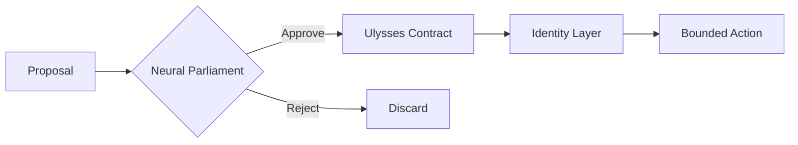

# Nomos

## Provably Bounded Governance for Autonomous AI

**Created by Carlos Pinto (xcoder-es)**

Neural Parliament • Ulysses Contracts • Identity Layer

A formal framework for bounded autonomous decision-making.

**Explore**

- [Theory](book/00-preface.md)
- [API](api/index.md)
- [Benchmarks](benchmarks/index.md)
- [GitHub](https://github.com/xcoder-es/nomos)

---

## Why

Optimization pressure erodes constraints that are not formally enforced. Nomos bounds autonomous behavior through deliberation, contracts, and a verifiable identity model before actions are executed.

## Architecture at a Glance



## Key Numbers

| Feature | Value |
|---------|------:|
| Parliament members | **7** |
| κ modes | **3** |
| Mutability tiers | **4** |
| Verified predictions | **12** |

## Quick Start

```bash
pip install -e ".[rl,minigrid]"
python -m src.nomos.runner speaker
```

---

## Explore More

- [Theory](book/00-preface.md)
- [API](api/index.md)
- [Benchmarks](benchmarks/index.md)
- [GitHub](https://github.com/xcoder-es/nomos)

## License

Licensed under the [Apache 2.0](https://www.apache.org/licenses/LICENSE-2.0) license.