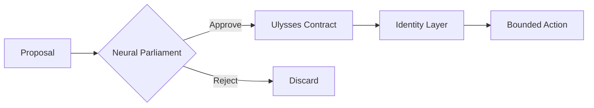

# Nomos

## Invariant-Checked Governance for Autonomous AI

**Created by Carlos Pinto (xcoder-es)**

Neural Parliament • Ulysses Contracts • Identity Layer

A formal framework for bounded autonomous decision-making.

**Explore**

- [Theory](book/00-preface.md)
- [API](api/index.md)
- [Benchmarks](benchmarks/index.md)
- [GitHub](https://github.com/Nomos-N4s/nomos)

---

## Why

Optimization pressure erodes constraints that are not formally enforced. Nomos bounds autonomous behavior through deliberation, contracts, and a verifiable identity model before actions are executed.

## The Headline Result

> **A safety check that scores proposer-supplied metadata has zero adversarial value: a 64×64-MLP PPO policy, given 100,000 training steps and never told the mechanism, learned to silence it on 100% of its genuinely unsafe proposals, on every seed.**

Wherever an agent self-declares the risk of its own actions, this is the failure mode; at least one independently grounded verifier is load-bearing. The governance layer survived this adversary only because
one committee verifies against ground truth instead of the proposer's claim —
the full result, its conditions, and its limitations are in
[Appendix E](book/appendix-e-rl-adversary.md).

## Architecture at a Glance


```mermaid
flowchart LR
    A[Proposal] --> B{Neural Parliament}
    B -->|Approve| C[Ulysses Contract]
    C --> D[Identity Layer]
    D --> E[Bounded Action]
    B -->|Reject| F[Discard]
```

## Key Numbers

| Feature | Value |
|---------|------:|
| Parliament members | **7** |
| κ modes | **3** |
| Mutability tiers | **4** |
| Verified predictions | **12** |

## Quick Start

```bash
pip install -e ".[rl,minigrid]"
python -m src.nomos.runner speaker
```

---

## Explore More

- [Theory](book/00-preface.md)
- [API](api/index.md)
- [Benchmarks](benchmarks/index.md)
- [GitHub](https://github.com/Nomos-N4s/nomos)

## License

Licensed under the [Apache 2.0](https://www.apache.org/licenses/LICENSE-2.0) license.